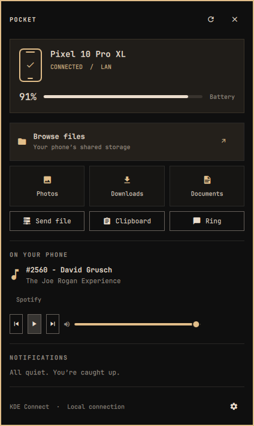
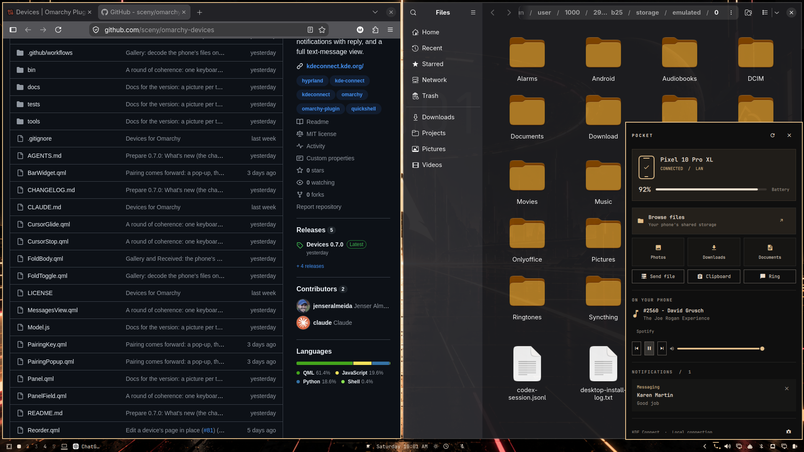

# Pocket — KDE Connect Bar

**Keep your phone in your pocket. Bring its essentials to your Omarchy bar.**

Pocket puts your phone's files, notifications, battery status and media controls
one click away, through KDE Connect. It lives behind a small phone icon and
**automatically matches your active Omarchy theme**—colors, fonts, spacing,
and corner styling, without a separate theme configuration.



## Your phone, within reach

- **Files without the fuss.** Open shared storage, camera photos, downloads or
  documents in Nautilus. Pocket mounts the phone on demand.
- **At-a-glance status.** See connection state, battery percentage and charging.
- **Notifications in one place.** Read synced phone notifications and dismiss
  individual ones directly from the panel.
- **Playback close at hand.** Select a phone player, pause or resume, skip tracks
  and adjust its volume.
- **Useful shortcuts.** Send a file, send your clipboard, or ring your phone.
- **Made for Omarchy.** Native bar popup, live theme matching, keyboard navigation,
  multiple paired devices, and scrolling that fits your monitor.

Pocket uses your existing KDE Connect pairing. No extra account, cloud service
or permanent background daemon is added. It does not provide SMS composition
or notification replies.

## Install

Tested on **Omarchy 4.0.4-1**, KDE Connect 26.08.0, a Pixel 10 Pro XL, and
Nautilus. Requires Omarchy's Quickshell plugin host and shared `qs.Ui` /
`qs.Commons` components; this is not a Waybar module.

### 1. Install the runtime dependencies

On Arch / Omarchy:

```bash
sudo pacman -S --needed kdeconnect sshfs kio-fuse nautilus python-gobject
```

Omarchy supplies `omarchy-file-select` for the desktop file chooser. Keep
Omarchy current if that command is missing. Python 3 and the Omarchy shell are
also required.

**On the Omarchy installation used to develop Pocket, both `sshfs` and
`kio-fuse` had to be installed separately:**

```bash
sudo pacman -S sshfs kio-fuse
```

They solve different parts of file browsing:

| Package | Purpose |
| --- | --- |
| `sshfs` | KDE Connect's SFTP filesystem mounting of the Android device. |
| `kio-fuse` | Bridges KDE/KIO filesystem locations to local paths for applications such as Nautilus. |

Before `kio-fuse` was installed, the phone could be mounted with SSHFS and its
actual mount opened manually, but KDE Connect's **Explore/Browse Device**
handoff to Nautilus failed. That established that mounting and opening a KIO
URL were separate issues.

Pocket declares both packages as runtime requirements for its supported
Omarchy/Nautilus setup and **checks that they are available**. Its own file
buttons open KDE Connect's advertised SSHFS mount directly, avoiding the KIO
URL handoff. `kio-fuse` is not an SSHFS dependency and Pocket does not use it to
perform the mount. Installing it does not guarantee that every upstream
KDE Connect/Nautilus URL-handling issue is resolved.

Missing dependencies appear in a **Finish setting up** card with instructions.
Affected file/share actions are disabled until requirements are available;
Pocket never installs packages or elevates privileges automatically. The
check also handles `kio-fuse` living under `/usr/lib` rather than on `PATH`.

### 2. Add Pocket to the bar

```bash
omarchy plugin add https://github.com/oidium/omarchy-pocket --enable
```

Pocket defaults to the right side of the bar. To enable it later:

```bash
omarchy plugin enable io.github.oidium.pocket --section right
```

### 3. Pair your phone

Install KDE Connect on the phone, open KDE Connect on the laptop, and pair the
devices. Enable the features you want to use:

- Filesystem expose and folder access for file browsing.
- Android notification access for notification sync.
- Media controls, with an active media session in a supported phone app.

The phone needs to be reachable through KDE Connect. Open the phone app if it
has gone offline, then use Pocket's refresh button.

## Controls

Click the phone icon to open Pocket. The settings button opens KDE Connect.

| Key | Action |
| --- | --- |
| Tab / Shift+Tab | Move between controls |
| Enter / Space | Activate the focused control |
| B | Browse phone files |
| R | Refresh device status |
| Esc | Close the panel |

Photos opens the phone's shared `DCIM` folder. Downloads opens `Download`;
Documents opens `Documents`. If a folder is not shared, Pocket displays an
error rather than opening an empty directory.

## Screenshots

The panel-only preview above shows the published plugin. The original desktop
capture below is preserved unchanged from initial development, with the
owner's permission; it shows the earlier Pocket prototype and its original
on-screen content.



## Privacy and behavior

- Reads paired-device status, battery, player metadata and synced notifications
  from the existing KDE Connect session D-Bus service.
- Notification text stays in memory and is rendered as plain text. Pocket
  writes no notification database or media cache.
- File sharing, clipboard sharing, ringing, dismissal and playback changes
  happen only when you activate the corresponding control.
- File transfers are handled by KDE Connect. A successful handoff is not a
  delivery receipt.
- Status refreshes every 4 seconds while open and every 30 seconds while closed.
- No shell interpolation is used for filenames, device IDs or player names.
- Dependencies are detected locally; Pocket makes no package downloads.

Like other Omarchy plugins, Pocket runs with your desktop user permissions.
The capabilities above are the ones it uses.

## Update or remove

```bash
omarchy plugin update io.github.oidium.pocket
```

To keep it installed but remove it from the bar:

```bash
omarchy plugin disable io.github.oidium.pocket
```

To uninstall:

```bash
omarchy plugin remove io.github.oidium.pocket
```

Removing Pocket does not unpair the phone, uninstall KDE Connect or remove the
shared runtime packages.

## Development and validation

```bash
python -m unittest discover -s . -p 'test_*.py'
omarchy plugin validate .
qmllint -I /usr/share/omarchy/shell Panel.qml
python bridge.py check-dependencies
python bridge.py snapshot
python bridge.py check-mount DEVICE_ID
```

The Pixel's battery, notifications, all four folder shortcuts and live Spotify
metadata/playback state/volume display were verified. Backend tests cover
missing dependencies, offline devices, failed mounts, unsafe paths, missing
folders, cancelled file selection and media command validation. Tests do not
send messages, ring the phone or interrupt playback.

Theme matching uses Omarchy's live shared color and style bindings. The preview
shows the developer's gold theme; a different active theme changes the panel's
appearance automatically.

## Credits and license

Created for [Oidium](https://github.com/oidium) with Agent Smith.
Design reference: [sceny.devices](https://github.com/sceny/omarchy-devices).
Pocket is an independent implementation, not a fork of that plugin.

[MIT](LICENSE). Not affiliated with or endorsed by KDE or Omarchy.
